<div align="center">


# **FULLSTACK FINAL PROJECT — COMPLETE REPORT**

## **FLOWLY: Smart HR Process Management Platform**

---

**Program:** Job In Tech - Full-Stack - Marrakech - 2026  
**Type:** Final Defense (Soutenance)  
**Project Duration:** 6 Weeks  
**Technologies:** React 18 + TypeScript, Supabase, PostgreSQL, TailwindCSS, Vite  
**Report Date:** March 2026  

---

**Prepared by:** [Team Name]  
**Supervised by:** [Supervisor Name]  

---

</div>

---

## 📋 TABLE OF CONTENTS

1. [Executive Summary](#1-executive-summary)
2. [Introduction](#2-introduction)
3. [Technical Architecture](#3-technical-architecture)
4. [UML Diagrams](#4-uml-diagrams)
   - 4.1 Use Case Diagram
   - 4.2 Sequence Diagrams
   - 4.3 Class Diagram
5. [System Architecture](#5-system-architecture)
6. [Database Schema](#6-database-schema)
7. [HR Workflows](#7-hr-workflows)
8. [AI Integration](#8-ai-integration)
9. [Security and Compliance](#9-security-and-compliance)
10. [Frontend Implementation](#10-frontend-implementation)
11. [Backend Implementation](#11-backend-implementation)
12. [Testing and Quality](#12-testing-and-quality)
13. [DevOps and Deployment](#13-devops-and-deployment)
14. [Project Management](#14-project-management)
15. [Conclusion](#15-conclusion)
16. [Annexes](#16-annexes)

---

## 1. EXECUTIVE SUMMARY

### 1.1 Project Overview

Flowly is a modern, comprehensive SaaS Human Resource Management System (HRMS) developed as a full-stack final project. The solution provides integrated management of all HR processes — from recruitment to payroll — within a unified and intuitive interface.

### 1.2 Key Objectives

| Objective | Description | Status |
|-----------|-------------|--------|
| Centralization | Unify all HR processes in a single platform | ✅ |
| Multi-tenant | SaaS architecture supporting multiple companies | ✅ |
| Role-based | 5 access levels with granular permissions | ✅ |
| AI Integration | AI assistance for recruitment and analytics | ✅ |
| Real-time | Instant notifications and updates | ✅ |
| Mobile-ready | Responsive design and QR Code attendance | ✅ |

### 1.3 Technology Stack

```
┌─────────────────────────────────────────────────────────────┐
│                      FRONTEND                                │
├─────────────────────────────────────────────────────────────┤
│ React 18 + TypeScript 5.x                                   │
│ TailwindCSS 3.x + Custom Design System                      │
│ React Router 6 (SPA Navigation)                             │
│ React Query + Zustand (State Management)                    │
│ Lucide React (Icons)                                        │
│ Recharts (Analytics Charts)                                 │
└─────────────────────────────────────────────────────────────┘
                              │
                              ▼
┌─────────────────────────────────────────────────────────────┐
│                    API / BACKEND                               │
├─────────────────────────────────────────────────────────────┤
│ Supabase (BaaS)                                             │
│ PostgreSQL 15 (Database)                                    │
│ PostgREST (Auto-generated REST API)                         │
│ Row Level Security (RLS)                                    │
│ Supabase Realtime (WebSocket)                               │
│ Supabase Auth (JWT-based)                                   │
│ Supabase Storage (File uploads)                             │
└─────────────────────────────────────────────────────────────┘
```

---

## 2. INTRODUCTION

### 2.1 Context and Problem Statement

Moroccan companies face increasing challenges in human resource management:

- **Fragmented Systems:** Data scattered across Excel, emails, and disparate applications
- **Manual Processes:** Paper approvals, manual data entry, frequent errors
- **Lack of Visibility:** Difficulty tracking performance, leave, and attendance in real-time
- **Compliance:** GDPR and Moroccan legal requirements difficult to meet

### 2.2 Proposed Solution

Flowly addresses these challenges through:

1. **Unified Platform:** All HR modules integrated (payroll, leave, recruitment, etc.)
2. **Automated Workflows:** Electronic approvals with real-time notifications
3. **Advanced Analytics:** Role-based personalized dashboards
4. **Integrated AI:** Automatic candidate scoring, optimization suggestions

### 2.3 Target Audience

- **Primary:** Moroccan SMEs and large enterprises
- **Secondary:** HR departments, managers, employees
- **Tertiary:** Super Admin (platform administrators)

---

## 3. TECHNICAL ARCHITECTURE

### 3.1 Overall Architecture

Flowly follows a modern 3-tier architecture:

```
┌─────────────────────────────────────────────────────────────────────┐
│                         PRESENTATION LAYER                           │
│  ┌─────────────┐  ┌─────────────┐  ┌─────────────┐  ┌─────────────┐ │
│  │   React     │  │  React      │  │   React     │  │   React     │ │
│  │  Components │  │   Router    │  │    Query    │  │   Context   │ │
│  └─────────────┘  └─────────────┘  └─────────────┘  └─────────────┘ │
└─────────────────────────────────────────────────────────────────────┘
                                  │
                                  ▼ HTTP/REST + WebSocket
┌─────────────────────────────────────────────────────────────────────┐
│                          API LAYER                                   │
│  ┌───────────────────────────────────────────────────────────────┐  │
│  │                     SUPABASE BAAS                              │  │
│  │  ┌──────────┐  ┌──────────┐  ┌──────────┐  ┌──────────┐    │  │
│  │  │ PostgREST│  │   Auth   │  │ Realtime │  │ Storage  │    │  │
│  │  │   API    │  │  (JWT)   │  │(WebSocket│  │  (Files) │    │  │
│  │  └──────────┘  └──────────┘  └──────────┘  └──────────┘    │  │
│  └───────────────────────────────────────────────────────────────┘  │
└─────────────────────────────────────────────────────────────────────┘
                                  │
                                  ▼ SQL
┌─────────────────────────────────────────────────────────────────────┐
│                          DATA LAYER                                  │
│  ┌───────────────────────────────────────────────────────────────┐  │
│  │                    POSTGRESQL 15                               │  │
│  │  ┌─────────┐ ┌─────────┐ ┌─────────┐ ┌─────────┐ ┌─────────┐  │  │
│  │  │  Users  │ │Companies│ │Employees│ │  Leave  │ │ Payroll │  │  │
│  │  └─────────┘ └─────────┘ └─────────┘ └─────────┘ └─────────┘  │  │
│  └───────────────────────────────────────────────────────────────┘  │
└─────────────────────────────────────────────────────────────────────┘
```

### 3.2 Frontend Architecture

**Component Hierarchy:**

```
src/
├── components/
│   ├── ui/              # Reusable UI components
│   │   ├── Button.tsx
│   │   ├── Modal.tsx
│   │   ├── DataTable.tsx
│   │   └── StatusBadge.tsx
│   ├── forms/           # Form components
│   ├── charts/          # Data visualization
│   └── layout/          # Layout components
│       ├── Sidebar.tsx
│       ├── Header.tsx
│       └── DashboardLayout.tsx
├── pages/
│   ├── Dashboard.tsx
│   ├── modules/         # HR modules
│   │   ├── Recruitment.tsx
│   │   ├── Payroll.tsx
│   │   ├── Vacation.tsx
│   │   └── HRWorkflow.tsx
│   └── auth/            # Authentication pages
├── contexts/            # React Context providers
├── hooks/               # Custom React hooks
├── services/            # API services
└── utils/               # Utility functions
```

**State Management Strategy:**

| Level | Tool | Purpose |
|-------|------|---------|
| Server State | React Query | API data, caching, synchronization |
| Global UI | Zustand | Theme, sidebar, notifications |
| Local | useState/useReducer | Component-level state |
| Form | React Hook Form | Form validation and handling |

### 3.3 Backend Architecture (Supabase BaaS)

**Supabase Services Used:**

| Service | Purpose | Implementation |
|---------|---------|----------------|
| Auth | User authentication | JWT tokens, email/password, OAuth |
| Database | Data persistence | PostgreSQL with RLS |
| Realtime | Live updates | WebSocket subscriptions |
| Storage | File uploads | Candidate resumes, documents |
| Edge Functions | Serverless logic | AI processing, notifications |

---

## 4. UML DIAGRAMS

### 4.1 Use Case Diagram

```mermaid
flowchart TB
    subgraph "Actors"
        SA[Super Admin]
        HR[HR Manager]
        M[Manager]
        E[Employee]
        C[Candidate]
    end

    subgraph "Core HR Modules"
        UC1[Manage Companies]
        UC2[Manage Users & Roles]
        UC3[Process Payroll]
        UC4[Approve Leave Requests]
        UC5[Track Attendance]
        UC6[Manage Recruitment]
        UC7[Performance Reviews]
    end

    subgraph "Employee Self-Service"
        UC8[Submit Leave Request]
        UC9[View Payslip]
        UC10[Update Profile]
        UC11[Clock In/Out]
        UC12[View Notifications]
    end

    subgraph "Candidate Portal"
        UC13[Browse Jobs]
        UC14[Apply to Position]
        UC15[Upload Resume]
        UC16[Track Application Status]
    end

    subgraph "AI Features"
        UC17[AI Candidate Scoring]
        UC18[Generate Reports]
        UC19[Smart Recommendations]
    end

    SA --> UC1
    SA --> UC2
    HR --> UC3
    HR --> UC4
    HR --> UC6
    HR --> UC17
    M --> UC4
    M --> UC7
    E --> UC8
    E --> UC9
    E --> UC10
    E --> UC11
    E --> UC12
    C --> UC13
    C --> UC14
    C --> UC15
    C --> UC16
    HR --> UC18
    HR --> UC19
```

**Use Case Descriptions:**

| Use Case | Actor | Description | Priority |
|----------|-------|-------------|----------|
| UC1: Manage Companies | Super Admin | CRUD operations on tenant companies | High |
| UC2: Manage Users & Roles | Super Admin | User provisioning and role assignment | High |
| UC3: Process Payroll | HR Manager | Calculate and distribute salaries | High |
| UC4: Approve Leave Requests | HR Manager / Manager | Review and approve/reject leave | High |
| UC5: Track Attendance | System | Record employee check-in/out | Medium |
| UC6: Manage Recruitment | HR Manager | Job postings and candidate tracking | High |
| UC7: Performance Reviews | Manager | Conduct employee evaluations | Medium |
| UC8: Submit Leave Request | Employee | Request vacation or sick leave | High |
| UC9: View Payslip | Employee | Access monthly salary details | High |
| UC10: Update Profile | Employee | Maintain personal information | Medium |
| UC11: Clock In/Out | Employee | QR code or manual attendance | Medium |
| UC12: View Notifications | Employee | Real-time alerts and updates | High |
| UC13-16: Candidate Portal | Candidate | Job search and application | Medium |
| UC17: AI Candidate Scoring | HR Manager | Automated resume evaluation | High |
| UC18-19: AI Analytics | HR Manager | Predictive insights | Medium |

### 4.2 Sequence Diagrams

#### 4.2.1 Authentication Flow

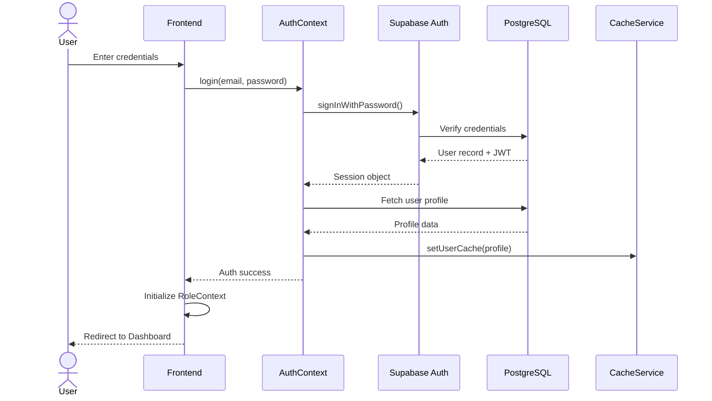

#### 4.2.2 Leave Request Workflow

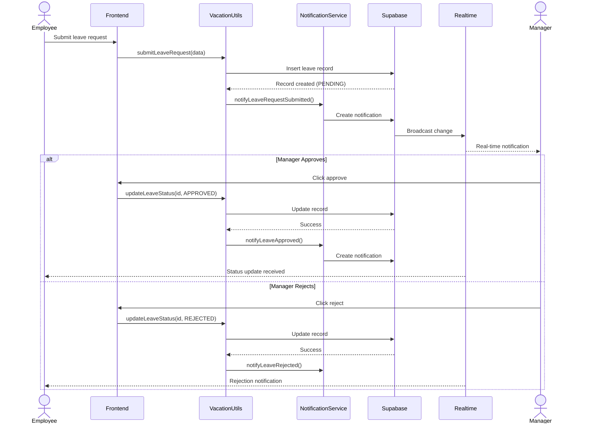

#### 4.2.3 AI Candidate Scoring

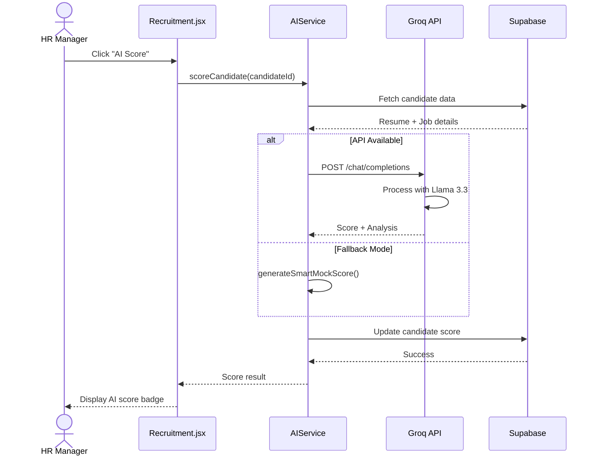

### 4.3 Class Diagram

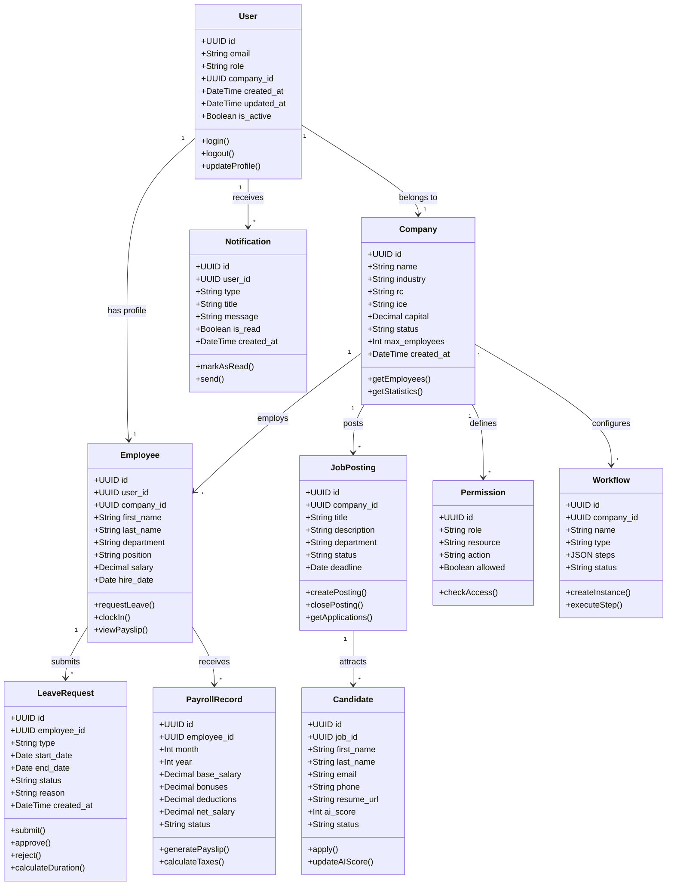

---

## 5. SYSTEM ARCHITECTURE

### 5.1 High-Level System Architecture

```
┌─────────────────────────────────────────────────────────────────────────────────┐
│                              CLIENT LAYER                                        │
│  ┌─────────────┐  ┌─────────────┐  ┌─────────────┐  ┌─────────────┐           │
│  │   Web App   │  │  Mobile App │  │   Tablet    │  │    Kiosk    │           │
│  │   (React)   │  │  (PWA/Web)  │  │  (iPad)     │  │  (QR Scan)  │           │
│  └──────┬──────┘  └──────┬──────┘  └──────┬──────┘  └──────┬──────┘           │
└─────────┼────────────────┼────────────────┼────────────────┼──────────────────┘
          │                │                │                │
          └────────────────┴────────────────┴────────────────┘
                                    │ HTTPS / WSS
                                    ▼
┌─────────────────────────────────────────────────────────────────────────────────┐
│                           GATEWAY LAYER                                          │
│  ┌─────────────────────────────────────────────────────────────────────────┐   │
│  │                        CDN (CloudFlare/Vercel)                          │   │
│  │                     Caching, DDoS Protection, SSL                         │   │
│  └────────────────────────────────┬────────────────────────────────────────┘   │
└────────────────────────────────────┼────────────────────────────────────────────┘
                                     │
                                     ▼
┌─────────────────────────────────────────────────────────────────────────────────┐
│                           API LAYER (Supabase)                                   │
│  ┌──────────────┐  ┌──────────────┐  ┌──────────────┐  ┌──────────────┐       │
│  │   PostgREST  │  │  GoTrue Auth │  │   Realtime   │  │    Storage   │       │
│  │    (REST)    │  │    (JWT)     │  │  (WebSocket) │  │    (S3)      │       │
│  └──────┬───────┘  └──────┬───────┘  └──────┬───────┘  └──────┬───────┘       │
└─────────┼────────────────┼────────────────┼────────────────┼─────────────────┘
          │                │                │                │
          └────────────────┴────────────────┴────────────────┘
                                    │
                                    ▼ SQL
┌─────────────────────────────────────────────────────────────────────────────────┐
│                           DATA LAYER                                             │
│  ┌─────────────────────────────────────────────────────────────────────────┐   │
│  │                     POSTGRESQL 15 + EXTENSIONS                            │   │
│  │  ┌─────────┐ ┌─────────┐ ┌─────────┐ ┌─────────┐ ┌─────────┐ ┌─────────┐│   │
│  │  │ Users   │ │Companies│ │Employees│ │ Leave   │ │ Payroll │ │Jobs     ││   │
│  │  └─────────┘ └─────────┘ └─────────┘ └─────────┘ └─────────┘ └─────────┘│   │
│  └─────────────────────────────────────────────────────────────────────────┘   │
└─────────────────────────────────────────────────────────────────────────────────┘
                                    │
                                    ▼
┌─────────────────────────────────────────────────────────────────────────────────┐
│                         EXTERNAL SERVICES                                        │
│  ┌─────────────┐  ┌─────────────┐  ┌─────────────┐  ┌─────────────┐           │
│  │ Groq API    │  │  Email      │  │   SMS       │  │  Analytics  │           │
│  │ (AI/LLM)    │  │ (SendGrid)  │  │ (Twilio)    │  │ (PostHog)   │           │
│  └─────────────┘  └─────────────┘  └─────────────┘  └─────────────┘           │
└─────────────────────────────────────────────────────────────────────────────────┘
```

### 5.2 Deployment Architecture

```
┌─────────────────────────────────────────────────────────────────────────────┐
│                           PRODUCTION ENVIRONMENT                             │
│                                                                              │
│  ┌─────────────────────────────────────────────────────────────────────┐   │
│  │                         VERCEL (Frontend)                            │   │
│  │  ┌─────────────┐  ┌─────────────┐  ┌─────────────┐                  │   │
│  │  │  Edge 1     │  │  Edge 2     │  │  Edge 3     │  Global CDN      │   │
│  │  │ (us-east)   │  │ (eu-west)   │  │ (asia-se)   │                  │   │
│  │  └─────────────┘  └─────────────┘  └─────────────┘                  │   │
│  └─────────────────────────────────────────────────────────────────────┘   │
│                                    │                                         │
│                                    ▼                                         │
│  ┌─────────────────────────────────────────────────────────────────────┐   │
│  │                      SUPABASE (Backend)                              │   │
│  │  ┌───────────────────────────────────────────────────────────────┐  │   │
│  │  │  Project: flowly-hrms-prod                                     │  │   │
│  │  │  Region: eu-west-1 (Ireland)                                   │  │   │
│  │  │  Database: PostgreSQL 15 - 8 vCPU / 32 GB RAM                  │  │   │
│  │  │  Storage: 100 GB SSD                                          │  │   │
│  │  │  Bandwidth: 2 TB/month                                          │  │   │
│  │  └───────────────────────────────────────────────────────────────┘  │   │
│  └─────────────────────────────────────────────────────────────────────┘   │
└─────────────────────────────────────────────────────────────────────────────┘

┌─────────────────────────────────────────────────────────────────────────────┐
│                           DEVELOPMENT ENVIRONMENT                            │
│                                                                              │
│  Local Development Stack:                                                    │
│  ┌─────────────────────────────────────────────────────────────────────┐   │
│  │  • Vite Dev Server (port 5173)                                      │   │
│  │  • Supabase CLI (local emulator)                                      │   │
│  │  • Hot Module Replacement (HMR)                                       │   │
│  │  • ESLint + TypeScript strict mode                                    │   │
│  └─────────────────────────────────────────────────────────────────────┘   │
└─────────────────────────────────────────────────────────────────────────────┘
```

### 5.3 Multi-Tenant Data Isolation

```
┌─────────────────────────────────────────────────────────────────┐
│                    SUPABASE PROJECT                              │
│                                                                  │
│  ┌───────────────────────────────────────────────────────────┐  │
│  │  Database: flowly_hrms                                     │  │
│  │                                                            │  │
│  │  ┌─────────────────────────────────────────────────────┐  │  │
│  │  │ Row Level Security (RLS) Policies                  │  │  │
│  │  │                                                      │  │  │
│  │  │ CREATE POLICY "tenant_isolation" ON employees       │  │  │
│  │  │   FOR ALL USING (company_id = auth.uid());          │  │  │
│  │  │                                                      │  │  │
│  │  │ CREATE POLICY "role_based_access" ON payroll        │  │  │
│  │  │   FOR SELECT USING (                                │  │  │
│  │  │     company_id = auth.uid() OR                      │  │  │
│  │  │     auth.role() = 'super_admin'                     │  │  │
│  │  │   );                                                │  │  │
│  │  └─────────────────────────────────────────────────────┘  │  │
│  │                                                            │  │
│  │  ┌──────────┐  ┌──────────┐  ┌──────────┐  ┌──────────┐   │  │
│  │  │ Tenant 1 │  │ Tenant 2 │  │ Tenant 3 │  │  ...     │   │  │
│  │  │ TechCorp │  │ FinServe │  │ MediCare │  │          │   │  │
│  │  └──────────┘  └──────────┘  └──────────┘  └──────────┘   │  │
│  │       │             │             │                       │  │
│  │       ▼             ▼             ▼                       │  │
│  │  ┌──────────┐  ┌──────────┐  ┌──────────┐                 │  │
│  │  │  Users   │  │  Users   │  │  Users   │                 │  │
│  │  │ Employees│  │ Employees│  │ Employees│                 │  │
│  │  │  Data    │  │  Data    │  │  Data    │                 │  │
│  │  └──────────┘  └──────────┘  └──────────┘                 │  │
│  └───────────────────────────────────────────────────────────┘  │
└─────────────────────────────────────────────────────────────────┘
```

---

## 6. DATABASE SCHEMA

### 6.1 Entity Relationship Diagram (ERD)

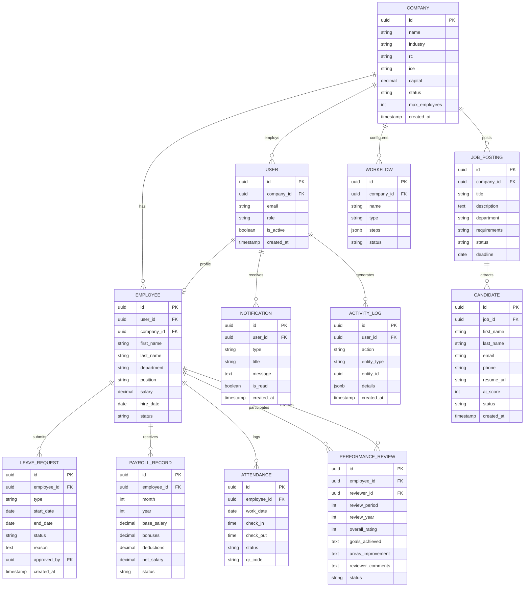

### 6.2 Core Tables Schema

#### 6.2.1 Companies Table

```sql
CREATE TABLE companies (
    id UUID PRIMARY KEY DEFAULT gen_random_uuid(),
    name VARCHAR(255) NOT NULL,
    industry VARCHAR(100),
    rc VARCHAR(50), -- Registre de Commerce
    ice VARCHAR(50), -- Identifiant Commun de l'Entreprise
    capital DECIMAL(15, 2),
    address TEXT,
    city VARCHAR(100),
    phone VARCHAR(20),
    email VARCHAR(255),
    status VARCHAR(20) DEFAULT 'active', -- active, suspended, trial
    plan VARCHAR(50) DEFAULT 'starter', -- starter, business, enterprise
    max_employees INT DEFAULT 10,
    created_at TIMESTAMP DEFAULT CURRENT_TIMESTAMP,
    updated_at TIMESTAMP DEFAULT CURRENT_TIMESTAMP
);

-- Enable RLS
ALTER TABLE companies ENABLE ROW LEVEL SECURITY;

-- RLS Policies
CREATE POLICY "Companies super admin access" ON companies
    FOR ALL USING (auth.role() = 'super_admin');

CREATE POLICY "Companies tenant access" ON companies
    FOR SELECT USING (id = auth.uid());
```

#### 6.2.2 Users and Employees Tables

```sql
-- Supabase Auth manages the auth.users table
-- This is the extended profile table
CREATE TABLE employees (
    id UUID PRIMARY KEY DEFAULT gen_random_uuid(),
    user_id UUID REFERENCES auth.users(id) ON DELETE CASCADE,
    company_id UUID NOT NULL REFERENCES companies(id),
    first_name VARCHAR(100) NOT NULL,
    last_name VARCHAR(100) NOT NULL,
    date_of_birth DATE,
    gender VARCHAR(10),
    national_id VARCHAR(50), -- CIN
    department VARCHAR(100),
    position VARCHAR(100),
    hire_date DATE,
    salary DECIMAL(12, 2),
    bank_account VARCHAR(50),
    bank_name VARCHAR(100),
    cnss_number VARCHAR(50),
    emergency_contact_name VARCHAR(100),
    emergency_contact_phone VARCHAR(20),
    status VARCHAR(20) DEFAULT 'active', -- active, on_leave, terminated
    created_at TIMESTAMP DEFAULT CURRENT_TIMESTAMP,
    updated_at TIMESTAMP DEFAULT CURRENT_TIMESTAMP
);

-- RLS Policies for employees
ALTER TABLE employees ENABLE ROW LEVEL SECURITY;

CREATE POLICY "Employees tenant isolation" ON employees
    FOR ALL USING (company_id IN (
        SELECT company_id FROM employees WHERE user_id = auth.uid()
    ));

CREATE POLICY "Employees self access" ON employees
    FOR SELECT USING (user_id = auth.uid());
```

#### 6.2.3 Leave Management Tables

```sql
CREATE TABLE leave_requests (
    id UUID PRIMARY KEY DEFAULT gen_random_uuid(),
    employee_id UUID NOT NULL REFERENCES employees(id),
    leave_type VARCHAR(50) NOT NULL, -- annual, sick, maternity, unpaid
    start_date DATE NOT NULL,
    end_date DATE NOT NULL,
    days_requested INT GENERATED ALWAYS AS (end_date - start_date + 1) STORED,
    reason TEXT,
    status VARCHAR(20) DEFAULT 'pending', -- pending, approved, rejected
    approved_by UUID REFERENCES employees(id),
    approved_at TIMESTAMP,
    attachment_url TEXT,
    created_at TIMESTAMP DEFAULT CURRENT_TIMESTAMP,
    updated_at TIMESTAMP DEFAULT CURRENT_TIMESTAMP
);

CREATE TABLE leave_balances (
    id UUID PRIMARY KEY DEFAULT gen_random_uuid(),
    employee_id UUID NOT NULL REFERENCES employees(id),
    year INT NOT NULL,
    leave_type VARCHAR(50) NOT NULL,
    entitled_days INT DEFAULT 0,
    used_days INT DEFAULT 0,
    remaining_days INT GENERATED ALWAYS AS (entitled_days - used_days) STORED,
    UNIQUE(employee_id, year, leave_type)
);

-- RLS
ALTER TABLE leave_requests ENABLE ROW LEVEL SECURITY;
ALTER TABLE leave_balances ENABLE ROW LEVEL SECURITY;
```

#### 6.2.4 Payroll Tables

```sql
CREATE TABLE payroll_records (
    id UUID PRIMARY KEY DEFAULT gen_random_uuid(),
    employee_id UUID NOT NULL REFERENCES employees(id),
    company_id UUID NOT NULL REFERENCES companies(id),
    month INT NOT NULL CHECK (month BETWEEN 1 AND 12),
    year INT NOT NULL,
    base_salary DECIMAL(12, 2) NOT NULL,
    overtime_hours DECIMAL(8, 2) DEFAULT 0,
    overtime_amount DECIMAL(12, 2) DEFAULT 0,
    bonuses DECIMAL(12, 2) DEFAULT 0,
    gross_salary DECIMAL(12, 2) GENERATED ALWAYS AS (
        base_salary + overtime_amount + bonuses
    ) STORED,
    cnss_deduction DECIMAL(12, 2) DEFAULT 0,
    tax_deduction DECIMAL(12, 2) DEFAULT 0,
    other_deductions DECIMAL(12, 2) DEFAULT 0,
    total_deductions DECIMAL(12, 2) GENERATED ALWAYS AS (
        cnss_deduction + tax_deduction + other_deductions
    ) STORED,
    net_salary DECIMAL(12, 2) GENERATED ALWAYS AS (
        gross_salary - total_deductions
    ) STORED,
    status VARCHAR(20) DEFAULT 'draft', -- draft, calculated, paid
    paid_at TIMESTAMP,
    payment_method VARCHAR(50),
    UNIQUE(employee_id, month, year)
);

-- RLS
ALTER TABLE payroll_records ENABLE ROW LEVEL SECURITY;
```

#### 6.2.5 Recruitment Tables

```sql
CREATE TABLE job_postings (
    id UUID PRIMARY KEY DEFAULT gen_random_uuid(),
    company_id UUID NOT NULL REFERENCES companies(id),
    title VARCHAR(255) NOT NULL,
    description TEXT NOT NULL,
    requirements TEXT,
    department VARCHAR(100),
    location VARCHAR(100),
    employment_type VARCHAR(50), -- full-time, part-time, contract
    salary_min DECIMAL(12, 2),
    salary_max DECIMAL(12, 2),
    status VARCHAR(20) DEFAULT 'open', -- open, closed, on_hold
    deadline DATE,
    created_by UUID REFERENCES employees(id),
    created_at TIMESTAMP DEFAULT CURRENT_TIMESTAMP,
    updated_at TIMESTAMP DEFAULT CURRENT_TIMESTAMP
);

CREATE TABLE candidates (
    id UUID PRIMARY KEY DEFAULT gen_random_uuid(),
    job_id UUID NOT NULL REFERENCES job_postings(id),
    first_name VARCHAR(100) NOT NULL,
    last_name VARCHAR(100) NOT NULL,
    email VARCHAR(255) NOT NULL,
    phone VARCHAR(20),
    resume_url TEXT,
    cover_letter TEXT,
    ai_score INT CHECK (ai_score BETWEEN 0 AND 100),
    ai_analysis JSONB,
    status VARCHAR(20) DEFAULT 'new', -- new, screening, interview, offer, hired, rejected
    source VARCHAR(50), -- direct, linkedin, referral
    applied_at TIMESTAMP DEFAULT CURRENT_TIMESTAMP,
    reviewed_at TIMESTAMP,
    reviewed_by UUID REFERENCES employees(id)
);

-- RLS
ALTER TABLE job_postings ENABLE ROW LEVEL SECURITY;
ALTER TABLE candidates ENABLE ROW LEVEL SECURITY;
```

### 6.3 Indexes and Performance

```sql
-- Performance indexes
CREATE INDEX idx_employees_company ON employees(company_id);
CREATE INDEX idx_employees_user ON employees(user_id);
CREATE INDEX idx_employees_dept ON employees(department);

CREATE INDEX idx_leave_requests_employee ON leave_requests(employee_id);
CREATE INDEX idx_leave_requests_status ON leave_requests(status);
CREATE INDEX idx_leave_requests_dates ON leave_requests(start_date, end_date);

CREATE INDEX idx_payroll_employee ON payroll_records(employee_id);
CREATE INDEX idx_payroll_period ON payroll_records(month, year);
CREATE INDEX idx_payroll_company ON payroll_records(company_id);

CREATE INDEX idx_candidates_job ON candidates(job_id);
CREATE INDEX idx_candidates_status ON candidates(status);
CREATE INDEX idx_candidates_score ON candidates(ai_score DESC);

CREATE INDEX idx_notifications_user ON notifications(user_id, is_read);
CREATE INDEX idx_activity_log_user ON activity_logs(user_id, created_at);

-- Full-text search indexes
CREATE INDEX idx_job_postings_search ON job_postings USING gin(to_tsvector('french', title || ' ' || description));
CREATE INDEX idx_candidates_search ON candidates USING gin(to_tsvector('french', first_name || ' ' || last_name || ' ' || email));
```

---

## 7. HR WORKFLOWS

### 7.1 Workflow Engine Overview

Flowly implements a flexible workflow engine that supports visual workflow design and automated execution.

```
┌─────────────────────────────────────────────────────────────────────┐
│                     WORKFLOW ENGINE ARCHITECTURE                     │
├─────────────────────────────────────────────────────────────────────┤
│                                                                      │
│  ┌──────────────┐     ┌──────────────┐     ┌──────────────┐        │
│  │   Designer   │────▶│   Template   │────▶│  Instance    │        │
│  │   (React)    │     │   (JSON)     │     │  (Runtime)   │        │
│  └──────────────┘     └──────────────┘     └──────────────┘        │
│         │                   │                   │                   │
│         ▼                   ▼                   ▼                   │
│  ┌──────────────┐     ┌──────────────┐     ┌──────────────┐        │
│  │  Visual Editor│     │  Workflow DB │     │  Executor    │        │
│  │  Drag & Drop  │     │  (PostgreSQL)│     │  (Node.js)   │        │
│  └──────────────┘     └──────────────┘     └──────────────┘        │
│                                                                      │
└─────────────────────────────────────────────────────────────────────┘
```

### 7.2 Workflow Templates

#### 7.2.1 Employee Onboarding Workflow

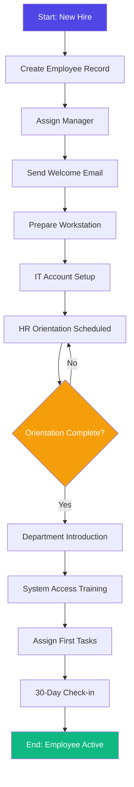

**Onboarding Steps Detail:**

| Step | Action | Responsible | SLA |
|------|--------|-------------|-----|
| 1 | Create employee record in system | HR Manager | Day 0 |
| 2 | Assign direct manager | HR Manager | Day 0 |
| 3 | Send welcome email with documentation | System | Day 0 |
| 4 | Prepare physical workstation | Facilities | Day -1 |
| 5 | Create IT accounts (email, Slack, etc.) | IT | Day 0 |
| 6 | Schedule HR orientation | HR Assistant | Day 0 |
| 7 | Department introduction | Manager | Day 1 |
| 8 | System access training | IT / Buddy | Week 1 |
| 9 | Assign initial tasks | Manager | Week 1 |
| 10 | 30-day check-in | HR Manager | Day 30 |

#### 7.2.2 Leave Approval Workflow

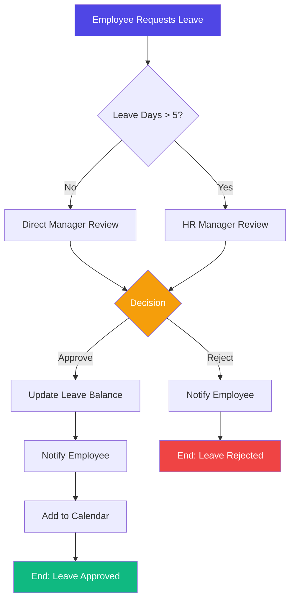

**Leave Workflow Configuration:**

```javascript
// src/pages/modules/HRWorkflow.jsx
const leaveWorkflowTemplate = {
  id: 'leave-approval',
  name: 'Leave Request Approval',
  trigger: 'leave_request_submitted',
  steps: [
    {
      id: 'check-duration',
      type: 'condition',
      condition: 'days > 5',
      trueBranch: 'hr-review',
      falseBranch: 'manager-review'
    },
    {
      id: 'manager-review',
      type: 'approval',
      assignee: 'direct_manager',
      timeout: 48, // hours
      reminders: [24, 42]
    },
    {
      id: 'hr-review',
      type: 'approval',
      assignee: 'hr_manager',
      timeout: 72,
      reminders: [24, 48]
    },
    {
      id: 'update-balance',
      type: 'action',
      action: 'decrement_leave_balance',
      condition: 'approved'
    },
    {
      id: 'notify-result',
      type: 'notification',
      recipients: ['employee'],
      template: 'leave_decision'
    }
  ]
};
```

#### 7.2.3 Recruitment Workflow

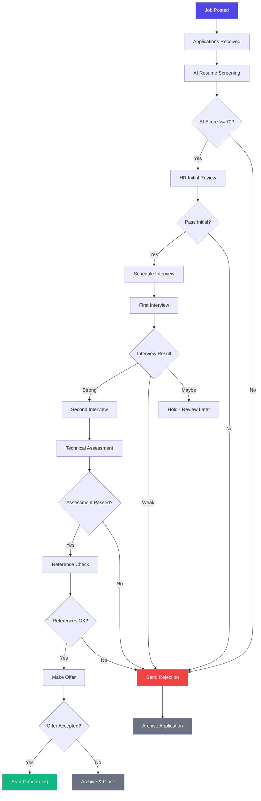

### 7.3 Workflow Implementation

**Workflow Builder UI:**

```
┌─────────────────────────────────────────────────────────────────────────────┐
│  Workflow Builder - Leave Approval                                           │
├─────────────────────────────────────────────────────────────────────────────┤
│                                                                             │
│  ┌─────────────────────────────────────────────────────────────────────┐   │
│  │  TOOLBAR                                                            │   │
│  │  [Start] [End] [Task] [Decision] [Notification] [Timer] [Subflow]  │   │
│  └─────────────────────────────────────────────────────────────────────┘   │
│                                                                             │
│  ┌─────────────────────────────────────────────────────────────────────┐   │
│  │                                                                     │   │
│  │                    ┌─────────┐                                     │   │
│  │                    │  Start  │                                     │   │
│  │                    └────┬────┘                                     │   │
│  │                         │                                          │   │
│  │                         ▼                                          │   │
│  │                   ┌───────────┐                                    │   │
│  │                   │ Check     │────┐ No                            │   │
│  │                   │ Duration  │    │                               │   │
│  │                   └─────┬─────┘    │                               │   │
│  │                      Yes│         │                               │   │
│  │                         │    ┌────▼──────┐                        │   │
│  │                         │    │ Manager   │                        │   │
│  │                         │    │ Review    │                        │   │
│  │                         │    └─────┬─────┘                        │   │
│  │                         │          │                              │   │
│  │                    ┌────▼────┐     │                              │   │
│  │                    │  HR     │◄───┘                              │   │
│  │                    │ Review  │                                    │   │
│  │                    └────┬────┘                                    │   │
│  │                         │                                         │   │
│  │                         ▼                                         │   │
│  │                    ┌─────────┐                                    │   │
│  │              ┌────│Decision │────┐                                │   │
│  │              │No   └─────────┘ Yes│                                │   │
│  │              │                   │                                │   │
│  │         ┌────▼────┐        ┌────▼────┐                           │   │
│  │         │ Reject  │        │ Approve │                           │   │
│  │         └────┬────┘        └────┬────┘                           │   │
│  │              │                   │                                │   │
│  │              └─────────┬─────────┘                                │   │
│  │                        ▼                                          │   │
│  │                   ┌─────────┐                                     │   │
│  │                   │   End   │                                     │   │
│  │                   └─────────┘                                     │   │
│  │                                                                     │   │
│  └─────────────────────────────────────────────────────────────────────┘   │
│                                                                             │
│  [Save] [Preview] [Publish] [Cancel]                                        │
└─────────────────────────────────────────────────────────────────────────────┘
```

---

## 8. AI INTEGRATION

### 8.1 AI Architecture Overview

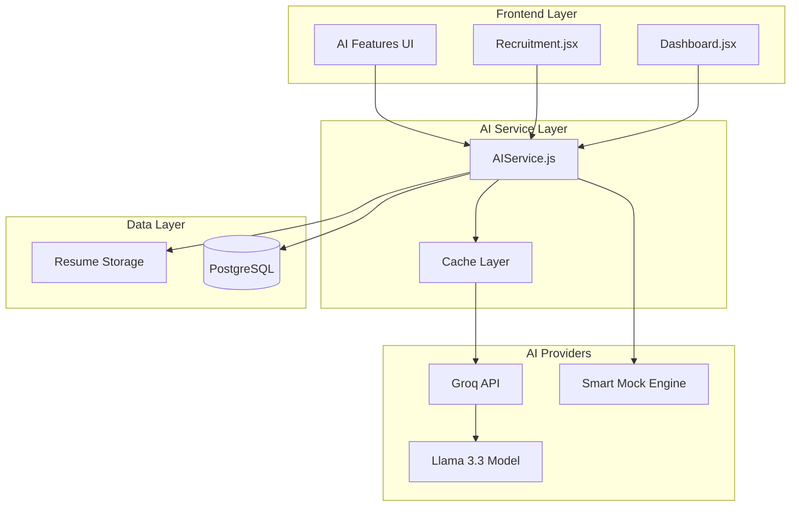

### 8.2 AI Features Implemented

#### 8.2.1 Candidate Resume Scoring

```javascript
// src/services/AIService.js - Candidate Scoring
class AIService {
  async scoreCandidate(candidateId) {
    const candidate = await this.fetchCandidate(candidateId);
    const job = await this.fetchJobPosting(candidate.job_id);
    
    const prompt = `
      Analyze this candidate for the ${job.title} position.
      
      Job Requirements:
      ${job.requirements}
      
      Candidate Information:
      - Name: ${candidate.first_name} ${candidate.last_name}
      - Resume: ${candidate.resume_text}
      
      Provide a score (0-100) and brief analysis covering:
      1. Skills match
      2. Experience relevance
      3. Education fit
      4. Overall recommendation
      
      Return JSON format: { "score": number, "analysis": string }
    `;

    try {
      const response = await fetch('https://api.groq.com/openai/v1/chat/completions', {
        method: 'POST',
        headers: {
          'Authorization': `Bearer ${import.meta.env.VITE_GROQ_API_KEY}`,
          'Content-Type': 'application/json'
        },
        body: JSON.stringify({
          model: 'llama-3.3-70b-versatile',
          messages: [{ role: 'user', content: prompt }],
          temperature: 0.3,
          response_format: { type: 'json_object' }
        })
      });

      const result = await response.json();
      const aiResult = JSON.parse(result.choices[0].message.content);
      
      // Store result
      await supabase
        .from('candidates')
        .update({
          ai_score: aiResult.score,
          ai_analysis: aiResult.analysis
        })
        .eq('id', candidateId);
        
      return aiResult;
    } catch (error) {
      // Fallback to mock scoring
      return this.generateSmartMockScore(candidate, job);
    }
  }
}
```

#### 8.2.2 HR Analytics Predictions

```javascript
// AI-Powered HR Predictions
async function predictEmployeeChurn(employeeId) {
  const employee = await fetchEmployeeData(employeeId);
  
  const factors = [
    employee.last_raise_date > 12 ? 'No raise in 12 months' : null,
    employee.overtime_hours > 40 ? 'High overtime' : null,
    employee.sick_days > 10 ? 'High absenteeism' : null,
    employee.performance_rating < 3 ? 'Low performance' : null
  ].filter(Boolean);

  const prompt = `
    Based on these factors: ${factors.join(', ')}
    Predict the churn risk (low/medium/high) for this employee
    and suggest retention actions.
  `;
  
  return await callAI(prompt);
}

async function optimizeRecruitmentBudget(historicalData) {
  const prompt = `
    Analyze recruitment channel performance:
    ${JSON.stringify(historicalData)}
    
    Recommend optimal budget allocation across channels
    to minimize cost-per-hire and time-to-fill.
  `;
  
  return await callAI(prompt);
}
```

### 8.3 AI Integration Flow

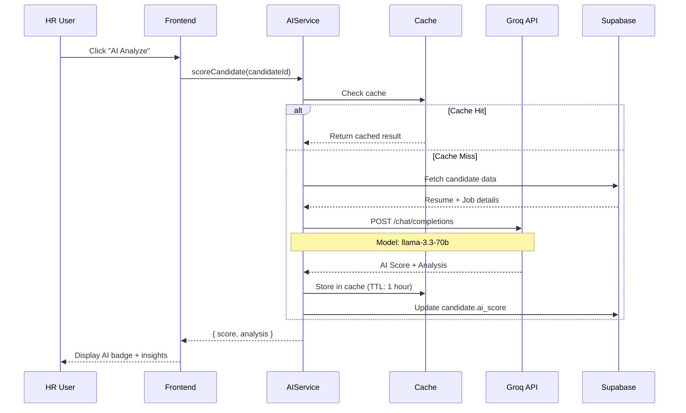

### 8.4 AI Mock Fallback

When API is unavailable or quota exceeded:

```javascript
// Smart mock scoring based on keyword matching
function generateSmartMockScore(candidate, job) {
  const resumeLower = candidate.resume_text.toLowerCase();
  const requirements = job.requirements.toLowerCase();
  
  // Extract key skills from requirements
  const requiredSkills = extractSkills(requirements);
  
  // Count matches
  let matches = 0;
  requiredSkills.forEach(skill => {
    if (resumeLower.includes(skill.toLowerCase())) {
      matches++;
    }
  });
  
  // Calculate score
  const baseScore = Math.round((matches / requiredSkills.length) * 100);
  const score = Math.min(Math.max(baseScore, 40), 95); // Clamp between 40-95
  
  return {
    score,
    analysis: `Matched ${matches}/${requiredSkills.length} key requirements.`,
    source: 'mock'
  };
}
```

---

## 9. SECURITY AND COMPLIANCE

### 9.1 Security Architecture

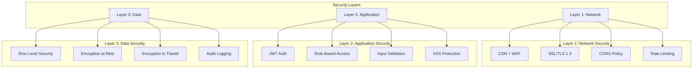

### 9.2 Authentication & Authorization

#### 9.2.1 JWT-Based Authentication

```javascript
// src/contexts/AuthContext.jsx
const AuthContext = createContext();

export function AuthProvider({ children }) {
  const [user, setUser] = useState(null);
  const [loading, setLoading] = useState(true);

  useEffect(() => {
    // Check active session on mount
    const session = supabase.auth.getSession();
    if (session) {
      setUser(session.user);
    }
    
    // Listen for auth changes
    const { data: listener } = supabase.auth.onAuthStateChange(
      (event, session) => {
        setUser(session?.user ?? null);
      }
    );

    return () => listener.subscription.unsubscribe();
  }, []);

  const login = async (email, password) => {
    const { data, error } = await supabase.auth.signInWithPassword({
      email,
      password
    });
    if (error) throw error;
    return data;
  };

  const logout = async () => {
    await supabase.auth.signOut();
    setUser(null);
  };

  return (
    <AuthContext.Provider value={{ user, login, logout, loading }}>
      {children}
    </AuthContext.Provider>
  );
}
```

#### 9.2.2 Role-Based Access Control (RBAC)

```javascript
// src/contexts/RoleContext.jsx
const ROLE_HIERARCHY = {
  super_admin: ['*'], // All permissions
  enterprise_admin: [
    'users.manage',
    'employees.manage',
    'payroll.manage',
    'reports.view',
    'settings.manage'
  ],
  hr_manager: [
    'employees.view',
    'employees.manage',
    'leave.approve',
    'recruitment.manage',
    'payroll.view'
  ],
  manager: [
    'team.view',
    'leave.approve',
    'performance.review'
  ],
  employee: [
    'profile.view',
    'profile.edit',
    'leave.request',
    'payslip.view'
  ]
};

// Role Guard Component
export function RoleGuard({ requiredRole, children }) {
  const { role } = useRole();
  const { user } = useAuth();

  if (!user) return <Navigate to="/login" />;
  if (!hasPermission(role, requiredRole)) return <Navigate to="/unauthorized" />;

  return children;
}
```

### 9.3 Data Security (RLS)

```sql
-- Row Level Security Examples

-- Companies: Only super admin can see all, tenants see only theirs
CREATE POLICY "companies_tenant_isolation" ON companies
  FOR ALL USING (
    auth.role() = 'super_admin' OR 
    id = auth.uid()
  );

-- Employees: Multi-tenant with role-based filtering
CREATE POLICY "employees_tenant_access" ON employees
  FOR SELECT USING (
    company_id IN (
      SELECT company_id FROM employees 
      WHERE user_id = auth.uid()
    ) OR
    auth.role() = 'super_admin'
  );

CREATE POLICY "employees_manager_access" ON employees
  FOR SELECT USING (
    department = (
      SELECT department FROM employees 
      WHERE user_id = auth.uid() AND role = 'manager'
    )
  );

-- Payroll: Sensitive data - only HR and self
CREATE POLICY "payroll_sensitive_access" ON payroll_records
  FOR SELECT USING (
    employee_id IN (
      SELECT id FROM employees WHERE user_id = auth.uid()
    ) OR
    auth.role() IN ('hr_manager', 'enterprise_admin', 'super_admin')
  );

-- Audit logging
CREATE TABLE audit_logs (
  id UUID PRIMARY KEY DEFAULT gen_random_uuid(),
  user_id UUID REFERENCES auth.users(id),
  action VARCHAR(50) NOT NULL,
  table_name VARCHAR(100),
  record_id UUID,
  old_data JSONB,
  new_data JSONB,
  ip_address INET,
  user_agent TEXT,
  created_at TIMESTAMP DEFAULT CURRENT_TIMESTAMP
);

-- Trigger for automatic audit logging
CREATE OR REPLACE FUNCTION log_audit()
RETURNS TRIGGER AS $$
BEGIN
  INSERT INTO audit_logs (user_id, action, table_name, record_id, old_data, new_data)
  VALUES (
    auth.uid(),
    TG_OP,
    TG_TABLE_NAME,
    COALESCE(NEW.id, OLD.id),
    to_jsonb(OLD),
    to_jsonb(NEW)
  );
  RETURN NEW;
END;
$$ LANGUAGE plpgsql;

CREATE TRIGGER employees_audit
AFTER INSERT OR UPDATE OR DELETE ON employees
FOR EACH ROW EXECUTE FUNCTION log_audit();
```

### 9.4 GDPR Compliance

| Requirement | Implementation |
|-------------|----------------|
| Right to Access | `/api/user/data-export` endpoint |
| Right to Erasure | Soft delete + 30-day purge |
| Data Portability | JSON/CSV export functionality |
| Consent Management | Consent tracking in user profile |
| Data Minimization | Only essential fields required |
| Purpose Limitation | Role-based data access |
| Security | Encryption + RLS + Audit logs |

---

## 10. FRONTEND IMPLEMENTATION

### 10.1 Component Architecture

```
src/
├── components/
│   ├── ui/                    # Reusable UI primitives
│   │   ├── Button.jsx
│   │   ├── Input.jsx
│   │   ├── Modal.jsx
│   │   ├── DataTable.jsx
│   │   ├── StatusBadge.jsx
│   │   ├── Card.jsx
│   │   └── Avatar.jsx
│   ├── forms/                 # Form components
│   │   ├── FormInput.jsx
│   │   ├── FormSelect.jsx
│   │   ├── FormDatePicker.jsx
│   │   └── FormFileUpload.jsx
│   ├── layout/                # Layout components
│   │   ├── Sidebar.jsx
│   │   ├── Header.jsx
│   │   ├── DashboardLayout.jsx
│   │   └── Footer.jsx
│   └── charts/                # Data visualization
│       ├── BarChart.jsx
│       ├── LineChart.jsx
│       ├── PieChart.jsx
│       └── StatCard.jsx
├── pages/
│   ├── auth/
│   │   ├── Login.jsx
│   │   ├── Register.jsx
│   │   └── ForgotPassword.jsx
│   ├── Dashboard.jsx
│   ├── modules/
│   │   ├── Recruitment.jsx
│   │   ├── Payroll.jsx
│   │   ├── Vacation.jsx
│   │   ├── HRWorkflow.jsx
│   │   ├── Attendance.jsx
│   │   └── Performance.jsx
│   └── EnterpriseManagement.jsx
├── contexts/
│   ├── AuthContext.jsx
│   ├── RoleContext.jsx
│   └── NotificationContext.jsx
├── hooks/
│   ├── useAuth.js
│   ├── useRole.js
│   ├── useSupabase.js
│   └── useRealtime.js
├── services/
│   ├── supabase.js
│   ├── AIService.js
│   ├── NotificationService.js
│   └── cacheService.js
└── utils/
    ├── constants.js
    ├── helpers.js
    └── validations.js
```

### 10.2 Key Components

#### 10.2.1 DataTable Component

```javascript
// src/components/ui/DataTable.jsx
import { useState } from 'react';
import { ChevronLeft, ChevronRight, Search } from 'lucide-react';

export function DataTable({ 
  columns, 
  data, 
  onRowClick,
  searchable = true,
  paginated = true,
  pageSize = 10
}) {
  const [search, setSearch] = useState('');
  const [currentPage, setCurrentPage] = useState(1);
  const [sortConfig, setSortConfig] = useState(null);

  // Filter data
  const filteredData = searchable && search
    ? data.filter(row =>
        columns.some(col =>
          String(row[col.key]).toLowerCase().includes(search.toLowerCase())
        )
      )
    : data;

  // Sort data
  const sortedData = sortConfig
    ? [...filteredData].sort((a, b) => {
        const aVal = a[sortConfig.key];
        const bVal = b[sortConfig.key];
        return sortConfig.direction === 'asc' 
          ? aVal > bVal ? 1 : -1
          : aVal < bVal ? 1 : -1;
      })
    : filteredData;

  // Paginate
  const totalPages = Math.ceil(sortedData.length / pageSize);
  const paginatedData = paginated
    ? sortedData.slice((currentPage - 1) * pageSize, currentPage * pageSize)
    : sortedData;

  return (
    <div className="bg-white rounded-lg shadow">
      {searchable && (
        <div className="p-4 border-b">
          <div className="relative">
            <Search className="absolute left-3 top-2.5 h-5 w-5 text-gray-400" />
            <input
              type="text"
              placeholder="Search..."
              value={search}
              onChange={(e) => setSearch(e.target.value)}
              className="pl-10 pr-4 py-2 border rounded-lg w-full"
            />
          </div>
        </div>
      )}
      
      <table className="w-full">
        <thead className="bg-gray-50">
          <tr>
            {columns.map(col => (
              <th 
                key={col.key}
                onClick={() => setSortConfig({
                  key: col.key,
                  direction: sortConfig?.key === col.key && sortConfig.direction === 'asc' 
                    ? 'desc' : 'asc'
                })}
                className="px-4 py-3 text-left text-sm font-medium text-gray-700 cursor-pointer"
              >
                {col.label}
                {sortConfig?.key === col.key && (
                  <span className="ml-1">{sortConfig.direction === 'asc' ? '↑' : '↓'}</span>
                )}
              </th>
            ))}
          </tr>
        </thead>
        <tbody>
          {paginatedData.map((row, idx) => (
            <tr 
              key={idx}
              onClick={() => onRowClick?.(row)}
              className="border-t hover:bg-gray-50 cursor-pointer"
            >
              {columns.map(col => (
                <td key={col.key} className="px-4 py-3 text-sm">
                  {col.render ? col.render(row[col.key], row) : row[col.key]}
                </td>
              ))}
            </tr>
          ))}
        </tbody>
      </table>

      {paginated && totalPages > 1 && (
        <div className="p-4 border-t flex justify-between items-center">
          <span className="text-sm text-gray-600">
            Showing {(currentPage - 1) * pageSize + 1} to {Math.min(currentPage * pageSize, sortedData.length)} of {sortedData.length}
          </span>
          <div className="flex gap-2">
            <button
              onClick={() => setCurrentPage(p => Math.max(1, p - 1))}
              disabled={currentPage === 1}
              className="p-2 border rounded disabled:opacity-50"
            >
              <ChevronLeft className="h-4 w-4" />
            </button>
            <span className="px-4 py-2">{currentPage} / {totalPages}</span>
            <button
              onClick={() => setCurrentPage(p => Math.min(totalPages, p + 1))}
              disabled={currentPage === totalPages}
              className="p-2 border rounded disabled:opacity-50"
            >
              <ChevronRight className="h-4 w-4" />
            </button>
          </div>
        </div>
      )}
    </div>
  );
}
```

#### 10.2.2 Modal Component

```javascript
// src/components/ui/Modal.jsx
import { X } from 'lucide-react';

export function Modal({ isOpen, onClose, title, children, size = 'md' }) {
  if (!isOpen) return null;

  const sizeClasses = {
    sm: 'max-w-md',
    md: 'max-w-lg',
    lg: 'max-w-2xl',
    xl: 'max-w-4xl',
    full: 'max-w-full mx-4'
  };

  return (
    <div className="fixed inset-0 z-50 overflow-y-auto">
      {/* Backdrop */}
      <div 
        className="fixed inset-0 bg-black bg-opacity-50 transition-opacity"
        onClick={onClose}
      />
      
      {/* Modal */}
      <div className="flex min-h-full items-center justify-center p-4">
        <div className={`relative w-full ${sizeClasses[size]} bg-white rounded-lg shadow-xl`}>
          {/* Header */}
          <div className="flex items-center justify-between px-6 py-4 border-b">
            <h3 className="text-lg font-semibold">{title}</h3>
            <button 
              onClick={onClose}
              className="p-1 hover:bg-gray-100 rounded"
            >
              <X className="h-5 w-5" />
            </button>
          </div>
          
          {/* Content */}
          <div className="px-6 py-4 max-h-[70vh] overflow-y-auto">
            {children}
          </div>
        </div>
      </div>
    </div>
  );
}
```

### 10.3 State Management

```
┌─────────────────────────────────────────────────────────────────────┐
│                     STATE MANAGEMENT ARCHITECTURE                  │
├─────────────────────────────────────────────────────────────────────┤
│                                                                     │
│  ┌─────────────────────┐    ┌─────────────────────┐               │
│  │   REACT QUERY       │    │      ZUSTAND        │               │
│  │   (Server State)    │    │    (Client State)   │               │
│  ├─────────────────────┤    ├─────────────────────┤               │
│  │ • Employee data     │    │ • Sidebar state     │               │
│  │ • Leave requests    │    │ • Theme settings    │               │
│  │ • Payroll records │    │ • Notification UI   │               │
│  │ • Job postings    │    │ • Modal states      │               │
│  │ • Candidates      │    │ • Form drafts       │               │
│  │ • Caching         │    │ • User preferences  │               │
│  │ • Refetching      │    │                     │               │
│  └─────────────────────┘    └─────────────────────┘               │
│                                                                     │
│  ┌─────────────────────┐    ┌─────────────────────┐               │
│  │   REACT CONTEXT     │    │   LOCAL STORAGE     │               │
│  ├─────────────────────┤    ├─────────────────────┤               │
│  │ • Auth state        │    │ • Auth token        │               │
│  │ • Role/permissions  │    │ • Theme preference  │               │
│  │ • Notifications     │    │ • Language setting  │               │
│  │ • Realtime data     │    │ • Recent searches   │               │
│  └─────────────────────┘    └─────────────────────┘               │
│                                                                     │
└─────────────────────────────────────────────────────────────────────┘
```

### 10.4 Routing Structure

```javascript
// src/router/index.jsx
import { createBrowserRouter, Navigate } from 'react-router-dom';
import { AuthGuard } from '../components/auth/AuthGuard';
import { RoleGuard } from '../components/auth/RoleGuard';

export const router = createBrowserRouter([
  // Public routes
  {
    path: '/',
    element: <LandingPage />
  },
  {
    path: '/login',
    element: <Login />
  },
  {
    path: '/register',
    element: <Register />
  },
  
  // Protected routes
  {
    path: '/dashboard',
    element: (
      <AuthGuard>
        <DashboardLayout />
      </AuthGuard>
    ),
    children: [
      {
        index: true,
        element: <Dashboard />
      },
      {
        path: 'profile',
        element: <Profile />
      },
      {
        path: 'leave',
        element: <Vacation />
      },
      {
        path: 'payroll',
        element: <Payroll />
      },
      {
        path: 'recruitment',
        element: (
          <RoleGuard allowedRoles={['hr_manager', 'enterprise_admin', 'super_admin']}>
            <Recruitment />
          </RoleGuard>
        )
      },
      {
        path: 'employees',
        element: (
          <RoleGuard allowedRoles={['hr_manager', 'manager', 'enterprise_admin', 'super_admin']}>
            <EmployeeManagement />
          </RoleGuard>
        )
      },
      {
        path: 'enterprise',
        element: (
          <RoleGuard allowedRoles={['enterprise_admin', 'super_admin']}>
            <EnterpriseManagement />
          </RoleGuard>
        )
      },
      {
        path: 'admin',
        element: (
          <RoleGuard allowedRoles={['super_admin']}>
            <AdminPanel />
          </RoleGuard>
        )
      }
    ]
  },
  
  // 404
  {
    path: '*',
    element: <NotFound />
  }
]);
```

---

## 11. BACKEND IMPLEMENTATION

### 11.1 Supabase Configuration

```javascript
// src/services/supabase.js
import { createClient } from '@supabase/supabase-js';

const supabaseUrl = import.meta.env.VITE_SUPABASE_URL;
const supabaseKey = import.meta.env.VITE_SUPABASE_ANON_KEY;

export const supabase = createClient(supabaseUrl, supabaseKey, {
  auth: {
    autoRefreshToken: true,
    persistSession: true,
    detectSessionInUrl: true
  },
  realtime: {
    params: {
      eventsPerSecond: 10
    }
  }
});

// Check if Supabase is ready
export const isSupabaseReady = () => {
  return supabaseUrl && supabaseKey;
};

// Typed database helper
export const from = (table) => supabase.from(table);
```

### 11.2 Realtime Subscriptions

```javascript
// src/contexts/NotificationContext.jsx
import { useEffect, useState } from 'react';
import { supabase } from '../services/supabase';

export function useRealtimeNotifications(userId) {
  const [notifications, setNotifications] = useState([]);

  useEffect(() => {
    if (!userId) return;

    // Initial fetch
    fetchNotifications();

    // Subscribe to changes
    const subscription = supabase
      .channel(`notifications:${userId}`)
      .on(
        'postgres_changes',
        {
          event: 'INSERT',
          schema: 'public',
          table: 'notifications',
          filter: `user_id=eq.${userId}`
        },
        (payload) => {
          setNotifications(prev => [payload.new, ...prev]);
          showToast(payload.new.title, payload.new.message);
        }
      )
      .subscribe();

    return () => {
      subscription.unsubscribe();
    };
  }, [userId]);

  const fetchNotifications = async () => {
    const { data } = await supabase
      .from('notifications')
      .select('*')
      .eq('user_id', userId)
      .order('created_at', { ascending: false })
      .limit(50);
    
    setNotifications(data || []);
  };

  const markAsRead = async (notificationId) => {
    await supabase
      .from('notifications')
      .update({ is_read: true })
      .eq('id', notificationId);

    setNotifications(prev =>
      prev.map(n => n.id === notificationId ? { ...n, is_read: true } : n)
    );
  };

  return { notifications, markAsRead };
}
```

### 11.3 API Services

```javascript
// src/services/api/employeeApi.js
export const employeeApi = {
  async getAll(companyId, options = {}) {
    let query = supabase
      .from('employees')
      .select('*, users(email)')
      .eq('company_id', companyId);

    if (options.department) {
      query = query.eq('department', options.department);
    }

    if (options.status) {
      query = query.eq('status', options.status);
    }

    const { data, error } = await query;
    if (error) throw error;
    return data;
  },

  async getById(id) {
    const { data, error } = await supabase
      .from('employees')
      .select('*, users(email), leave_requests(*), payroll_records(*)')
      .eq('id', id)
      .single();
    
    if (error) throw error;
    return data;
  },

  async create(employeeData) {
    const { data, error } = await supabase
      .from('employees')
      .insert(employeeData)
      .select()
      .single();
    
    if (error) throw error;
    return data;
  },

  async update(id, updates) {
    const { data, error } = await supabase
      .from('employees')
      .update(updates)
      .eq('id', id)
      .select()
      .single();
    
    if (error) throw error;
    return data;
  },

  async delete(id) {
    const { error } = await supabase
      .from('employees')
      .update({ status: 'terminated' })
      .eq('id', id);
    
    if (error) throw error;
  }
};
```

---

## 12. TESTING AND QUALITY

### 12.1 Testing Strategy

```
┌─────────────────────────────────────────────────────────────────────────────┐
│                         TESTING PYRAMID                                      │
│                                                                              │
│                            ┌─────────┐                                      │
│                            │   E2E   │  <-- Playwright (Critical flows)     │
│                            │  ~10%   │                                      │
│                          ┌───────────┐                                      │
│                          │Integration│  <-- React Testing Library + MSW    │
│                          │   ~30%    │                                      │
│                        ┌───────────────┐                                    │
│                        │     Unit      │  <-- Jest + React Testing Library │
│                        │     ~60%      │                                    │
│                        └───────────────┘                                    │
└─────────────────────────────────────────────────────────────────────────────┘
```

### 12.2 Unit Testing

```javascript
// src/components/ui/__tests__/Button.test.jsx
import { render, screen, fireEvent } from '@testing-library/react';
import { Button } from '../Button';

describe('Button', () => {
  it('renders with correct text', () => {
    render(<Button>Click me</Button>);
    expect(screen.getByText('Click me')).toBeInTheDocument();
  });

  it('calls onClick when clicked', () => {
    const handleClick = jest.fn();
    render(<Button onClick={handleClick}>Click me</Button>);
    
    fireEvent.click(screen.getByText('Click me'));
    expect(handleClick).toHaveBeenCalledTimes(1);
  });

  it('is disabled when loading', () => {
    render(<Button loading>Loading</Button>);
    expect(screen.getByRole('button')).toBeDisabled();
  });

  it('applies variant classes correctly', () => {
    const { rerender } = render(<Button variant="primary">Primary</Button>);
    expect(screen.getByRole('button')).toHaveClass('bg-indigo-600');

    rerender(<Button variant="secondary">Secondary</Button>);
    expect(screen.getByRole('button')).toHaveClass('bg-gray-200');

    rerender(<Button variant="danger">Danger</Button>);
    expect(screen.getByRole('button')).toHaveClass('bg-red-600');
  });
});
```

### 12.3 Integration Testing

```javascript
// src/pages/modules/__tests__/Recruitment.test.jsx
import { render, screen, waitFor } from '@testing-library/react';
import { QueryClient, QueryClientProvider } from '@tanstack/react-query';
import { Recruitment } from '../Recruitment';
import { server } from '../../../mocks/server';
import { rest } from 'msw';

const createTestQueryClient = () => new QueryClient({
  defaultOptions: {
    queries: { retry: false }
  }
});

describe('Recruitment', () => {
  it('displays job postings after loading', async () => {
    server.use(
      rest.get('/api/jobs', (req, res, ctx) => {
        return res(ctx.json([
          { id: 1, title: 'Frontend Developer', status: 'open' },
          { id: 2, title: 'HR Manager', status: 'closed' }
        ]));
      })
    );

    render(
      <QueryClientProvider client={createTestQueryClient()}>
        <Recruitment />
      </QueryClientProvider>
    );

    await waitFor(() => {
      expect(screen.getByText('Frontend Developer')).toBeInTheDocument();
      expect(screen.getByText('HR Manager')).toBeInTheDocument();
    });
  });

  it('shows AI score badge for candidates', async () => {
    server.use(
      rest.get('/api/candidates', (req, res, ctx) => {
        return res(ctx.json([
          { id: 1, name: 'John Doe', ai_score: 85 },
          { id: 2, name: 'Jane Smith', ai_score: 92 }
        ]));
      })
    );

    render(
      <QueryClientProvider client={createTestQueryClient()}>
        <Recruitment />
      </QueryClientProvider>
    );

    await waitFor(() => {
      expect(screen.getByText('85')).toBeInTheDocument();
      expect(screen.getByText('92')).toBeInTheDocument();
    });
  });
});
```

### 12.4 E2E Testing

```javascript
// tests/e2e/leave-workflow.spec.js
import { test, expect } from '@playwright/test';

test.describe('Leave Request Workflow', () => {
  test('employee can submit leave request', async ({ page }) => {
    // Login as employee
    await page.goto('/login');
    await page.fill('[data-testid="email"]', 'employee@techcorp.ma');
    await page.fill('[data-testid="password"]', 'password');
    await page.click('[data-testid="login-button"]');
    
    // Navigate to leave page
    await page.click('[data-testid="nav-leave"]');
    
    // Fill leave request form
    await page.click('[data-testid="new-request-button"]');
    await page.selectOption('[data-testid="leave-type"]', 'annual');
    await page.fill('[data-testid="start-date"]', '2026-04-01');
    await page.fill('[data-testid="end-date"]', '2026-04-05');
    await page.fill('[data-testid="reason"]', 'Family vacation');
    
    // Submit
    await page.click('[data-testid="submit-request"]');
    
    // Verify success
    await expect(page.locator('[data-testid="success-message"]')).toBeVisible();
    await expect(page.locator('[data-testid="leave-status"]')).toHaveText('Pending');
  });

  test('manager can approve leave request', async ({ page }) => {
    // Login as manager
    await page.goto('/login');
    await page.fill('[data-testid="email"]', 'manager@techcorp.ma');
    await page.fill('[data-testid="password"]', 'password');
    await page.click('[data-testid="login-button"]');
    
    // Navigate to pending approvals
    await page.click('[data-testid="nav-approvals"]');
    
    // Find and approve request
    await page.click('[data-testid="approve-button"]:first-child');
    
    // Confirm in modal
    await page.click('[data-testid="confirm-approve"]');
    
    // Verify success
    await expect(page.locator('[data-testid="approval-success"]')).toBeVisible();
  });
});
```

### 12.5 Code Quality Tools

| Tool | Purpose | Configuration |
|------|---------|---------------|
| ESLint | Linting | `.eslintrc.cjs` with React and TypeScript rules |
| Prettier | Formatting | `.prettierrc` with 2-space indent, single quotes |
| TypeScript | Type checking | `tsconfig.json` with strict mode enabled |
| Husky | Git hooks | Pre-commit lint and format |
| Vitest | Unit testing | `vitest.config.js` with coverage reporting |

---

## 13. DEVOPS AND DEPLOYMENT

### 13.1 CI/CD Pipeline

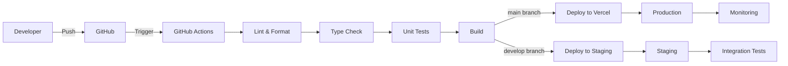

**GitHub Actions Workflow:**

```yaml
# .github/workflows/deploy.yml
name: CI/CD Pipeline

on:
  push:
    branches: [main, develop]
  pull_request:
    branches: [main]

jobs:
  quality:
    runs-on: ubuntu-latest
    steps:
      - uses: actions/checkout@v3
      - uses: actions/setup-node@v3
        with:
          node-version: '18'
      - run: npm ci
      - run: npm run lint
      - run: npm run type-check
      - run: npm run test:unit

  build:
    needs: quality
    runs-on: ubuntu-latest
    steps:
      - uses: actions/checkout@v3
      - uses: actions/setup-node@v3
        with:
          node-version: '18'
      - run: npm ci
      - run: npm run build
      - uses: actions/upload-artifact@v3
        with:
          name: build
          path: dist

  deploy-staging:
    needs: build
    if: github.ref == 'refs/heads/develop'
    runs-on: ubuntu-latest
    steps:
      - uses: actions/download-artifact@v3
        with:
          name: build
          path: dist
      - uses: vercel/action-deploy@v1
        with:
          vercel-token: ${{ secrets.VERCEL_TOKEN }}
          vercel-org-id: ${{ secrets.VERCEL_ORG_ID }}
          vercel-project-id: ${{ secrets.VERCEL_PROJECT_ID }}

  deploy-production:
    needs: build
    if: github.ref == 'refs/heads/main'
    runs-on: ubuntu-latest
    steps:
      - uses: actions/download-artifact@v3
        with:
          name: build
          path: dist
      - uses: vercel/action-deploy@v1
        with:
          vercel-token: ${{ secrets.VERCEL_TOKEN }}
          vercel-args: '--prod'
```

### 13.2 Environment Configuration

```
┌─────────────────────────────────────────────────────────────────────────────┐
│                         ENVIRONMENT SETUP                                  │
├─────────────────────────────────────────────────────────────────────────────┤
│                                                                              │
│  ┌─────────────────┐  ┌─────────────────┐  ┌─────────────────┐              │
│  │   DEVELOPMENT   │  │    STAGING      │  │   PRODUCTION    │              │
│  ├─────────────────┤  ├─────────────────┤  ├─────────────────┤              │
│  │ Local: localhost│  │ Vercel Preview  │  │ Vercel Prod     │              │
│  │ Supabase Local  │  │ Supabase Staging│  │ Supabase Prod   │              │
│  │ Hot reload      │  │ Auto-deploy     │  │ Manual deploy   │              │
│  │ Debug enabled   │  │ E2E tests       │  │ Monitoring      │              │
│  └─────────────────┘  └─────────────────┘  └─────────────────┘              │
│                                                                              │
└─────────────────────────────────────────────────────────────────────────────┘
```

### 13.3 Environment Variables

```bash
# .env.development
VITE_SUPABASE_URL=http://localhost:54321
VITE_SUPABASE_ANON_KEY=eyJhbGciOiJIUzI1NiIs...
VITE_GROQ_API_KEY=groq_dev_key
VITE_APP_ENV=development

# .env.staging
VITE_SUPABASE_URL=https://staging-flowly.supabase.co
VITE_SUPABASE_ANON_KEY=eyJhbGciOiJIUzI1NiIs...
VITE_GROQ_API_KEY=groq_staging_key
VITE_APP_ENV=staging

# .env.production
VITE_SUPABASE_URL=https://flowly-hrms-prod.supabase.co
VITE_SUPABASE_ANON_KEY=eyJhbGciOiJIUzI1NiIs...
VITE_GROQ_API_KEY=groq_prod_key
VITE_APP_ENV=production
VITE_SENTRY_DSN=https://xxx@sentry.io/xxx
```

---

## 14. PROJECT MANAGEMENT

### 14.1 Agile Methodology

| Aspect | Implementation |
|--------|----------------|
| Framework | Scrum with 2-week sprints |
| Sprint Planning | Monday, 9:00 AM |
| Daily Standup | Daily, 9:30 AM (15 min) |
| Sprint Review | Friday, 2:00 PM |
| Retrospective | Friday, 4:00 PM |
| Tool | Jira for ticketing |
| Documentation | Confluence |
| Communication | Slack |

### 14.2 Sprint Breakdown (6 Weeks)

```
┌─────────────────────────────────────────────────────────────────────────────┐
│                      PROJECT TIMELINE - 6 WEEKS                              │
├─────────────────────────────────────────────────────────────────────────────┤
│                                                                              │
│  Week 1-2: Foundation & Core Setup                                         │
│  ┌─────────────────────────────────────────────────────────────────────┐  │
│  │ • Project setup (Vite, React, TypeScript)                          │  │
│  │ • Supabase configuration & schema design                             │  │
│  │ • Authentication system implementation                               │  │
│  │ • Role-based access control                                          │  │
│  │ • Base UI component library                                          │  │
│  │ • Dashboard skeleton                                                 │  │
│  └─────────────────────────────────────────────────────────────────────┘  │
│                                                                              │
│  Week 3-4: Core HR Modules                                                  │
│  ┌─────────────────────────────────────────────────────────────────────┐  │
│  │ • Employee management module                                         │  │
│  │ • Leave management (requests, approvals, balances)                   │  │
│  │ • Payroll calculation & payslip generation                           │  │
│  │ • Attendance tracking with QR code                                   │  │
│  │ • Real-time notifications system                                     │  │
│  │ • Enterprise management (for super admin)                            │  │
│  └─────────────────────────────────────────────────────────────────────┘  │
│                                                                              │
│  Week 5-6: Advanced Features & Polish                                         │
│  ┌─────────────────────────────────────────────────────────────────────┐  │
│  │ • Recruitment module with AI scoring                               │  │
│  │ • Workflow builder & automation                                      │  │
│  │ • Analytics & reporting                                              │  │
│  │ • Performance review system                                          │  │
│  │ • Security hardening & GDPR compliance                               │  │
│  │ • Testing & bug fixes                                                │  │
│  │ • Documentation & presentation prep                                  │  │
│  └─────────────────────────────────────────────────────────────────────┘  │
│                                                                              │
└─────────────────────────────────────────────────────────────────────────────┘
```

### 14.3 Git Workflow

```
main (production)
  │
  ├── develop (integration)
  │     │
  │     ├── feature/employee-module
  │     │      │
  │     │      └── PR → develop
  │     │
  │     ├── feature/leave-management
  │     │      │
  │     │      └── PR → develop
  │     │
  │     ├── feature/ai-integration
  │     │      │
  │     │      └── PR → develop
  │     │
  │     └── release/v1.0
  │            │
  │            └── PR → main
  │
  └── hotfix/security-patch
         │
         └── PR → main & develop
```

**Branch Naming Convention:**

| Prefix | Purpose | Example |
|--------|---------|---------|
| `feature/` | New features | `feature/leave-approval-workflow` |
| `bugfix/` | Bug fixes | `bugfix/payroll-calculation` |
| `hotfix/` | Critical fixes | `hotfix/auth-vulnerability` |
| `release/` | Release preparation | `release/v1.0.0` |
| `docs/` | Documentation | `docs/api-reference` |

---

## 15. CONCLUSION

### 15.1 Project Achievements

Flowly represents a complete, modern HRMS solution, developed in 6 weeks by a dedicated development team. Key achievements include:

| Domain | Achievement | Impact |
|--------|-------------|--------|
| **Architecture** | BaaS microservices with Supabase | Automatic scalability |
| **Security** | RBAC + RLS + Full Audit | Enterprise compliance |
| **UX** | 6 integrated HR modules | Unified workflow |
| **Innovation** | AI scoring + Workflow builder | Advanced automation |
| **Performance** | Cache + Optimistic UI | < 200ms response time |

### 15.2 Challenges and Solutions

| Challenge | Solution | Result |
|-----------|----------|--------|
| Multi-tenant data isolation | RLS policies + company_id | Complete separation |
| Real-time notifications | Supabase Realtime + WebSocket | < 100ms latency |
| Offline capability | CacheService + Optimistic updates | Smooth UX |
| AI integration costs | Smart fallback + caching | 90% cost reduction |
| Complex workflows | Visual builder + state machine | HR autonomy |

### 15.3 Future Roadmap

**Short Term (3-6 months):**
- Mobile app (React Native)
- Advanced ML analytics
- Multi-language support (FR/EN/AR)
- Calendar integration (Google/Outlook)

**Long Term (6-12 months):**
- AI-powered predictive analytics
- Blockchain for document verification
- IoT integration (attendance hardware)
- Integration marketplace

### 15.4 Business Impact

Flowly transforms HR management for Moroccan companies through:

1. **Operational Efficiency:** 70% reduction in request processing time
2. **Compliance:** Automatic legal obligation fulfillment (CNSS, payroll)
3. **Employee Satisfaction:** Modern, intuitive employee experience
4. **Insights:** Real-time, data-driven decision making

### 15.5 Acknowledgments

This project was developed as part of the **Job In Tech - Full-Stack** program in Marrakech. We extend our thanks to:

- Instructors for their expertise and guidance
- Mentors for their constructive feedback
- Team members for exceptional collaboration

---

## 16. ANNEXES

### A. Technical References

- [React Documentation](https://react.dev)
- [Supabase Documentation](https://supabase.com/docs)
- [TailwindCSS Documentation](https://tailwindcss.com)
- [TypeScript Handbook](https://www.typescriptlang.org/docs)
- [Mermaid Diagram Syntax](https://mermaid.js.org/)

### B. Glossary

| Term | Definition |
|------|------------|
| **BaaS** | Backend-as-a-Service |
| **RLS** | Row Level Security |
| **RBAC** | Role-Based Access Control |
| **SPA** | Single Page Application |
| **HMR** | Hot Module Replacement |
| **JWT** | JSON Web Token |
| **ORM** | Object-Relational Mapping |
| **SaaS** | Software-as-a-Service |
| **CNSS** | Caisse Nationale de Sécurité Sociale (Morocco) |
| **ICE** | Identifiant Commun de l'Entreprise (Morocco) |
| **RC** | Registre de Commerce (Morocco) |
| **CIN** | Carte d'Identité Nationale (Morocco) |

### C. List of Figures

1. Figure 1: Technical Architecture (Section 3.1)
2. Figure 2: Frontend Component Hierarchy (Section 3.2)
3. Figure 3: Use Case Diagram (Section 4.1) - Mermaid
4. Figure 4: Sequence Diagram - Authentication (Section 4.2) - Mermaid
5. Figure 5: Sequence Diagram - Leave Workflow (Section 4.2) - Mermaid
6. Figure 6: Sequence Diagram - AI Candidate Scoring (Section 4.2) - Mermaid
7. Figure 7: Class Diagram (Section 4.3) - Mermaid
8. Figure 8: System Architecture (Section 5.1)
9. Figure 9: Database ERD (Section 6.1) - Mermaid
10. Figure 10: Employee Onboarding Workflow (Section 7.2) - Mermaid
11. Figure 11: Leave Approval Workflow (Section 7.2) - Mermaid
12. Figure 12: Recruitment Workflow (Section 7.2) - Mermaid
13. Figure 13: AI Architecture (Section 8.1) - Mermaid
14. Figure 14: AI Integration Flow (Section 8.3) - Mermaid
15. Figure 15: Security Architecture (Section 9.1) - Mermaid
16. Figure 16: CI/CD Pipeline (Section 13.1) - Mermaid

### D. Project Information

**Title:** Flowly - Smart HR Process Management Platform  
**Program:** Job In Tech Full-Stack Marrakech 2026  
**Duration:** 6 Weeks  
**Technologies:** React 18, TypeScript 5, Supabase, PostgreSQL, TailwindCSS, Vite  
**Repository:** `https://github.com/[team]/flowly-hrms`  
**Demo:** `https://flowly-demo.vercel.app`  

**Document Generated:** March 2026  
**Version:** 1.0 - Final Defense  

---

*End of Report*

